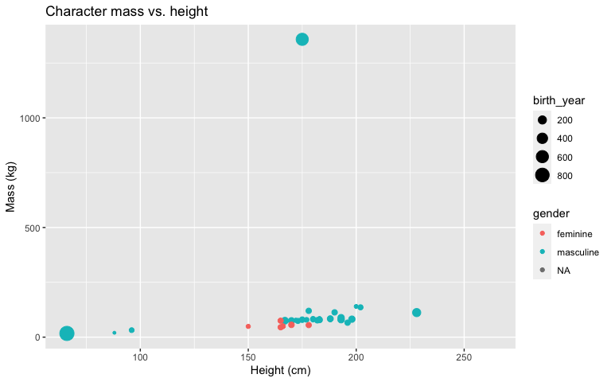
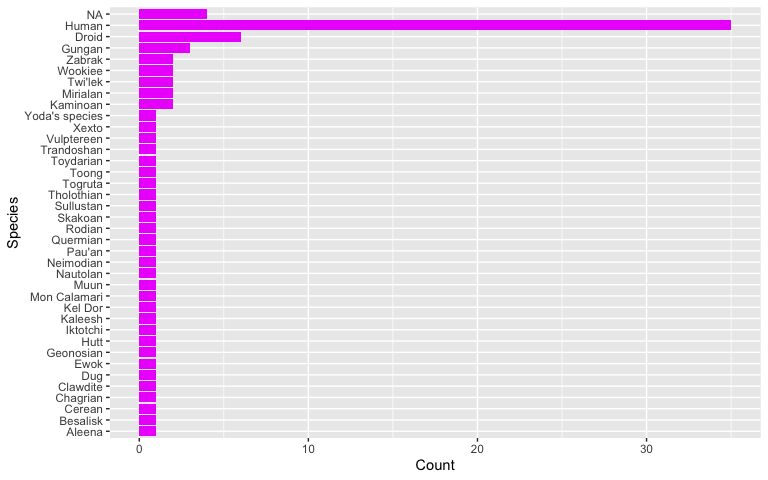
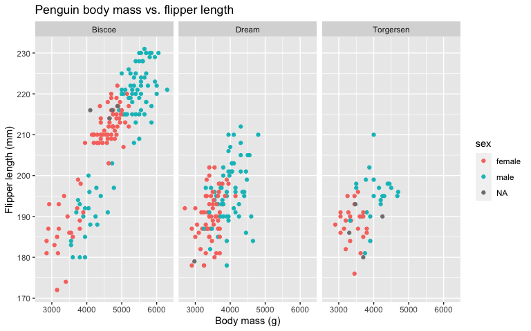
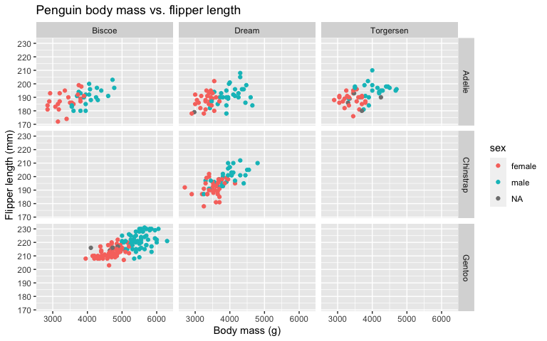
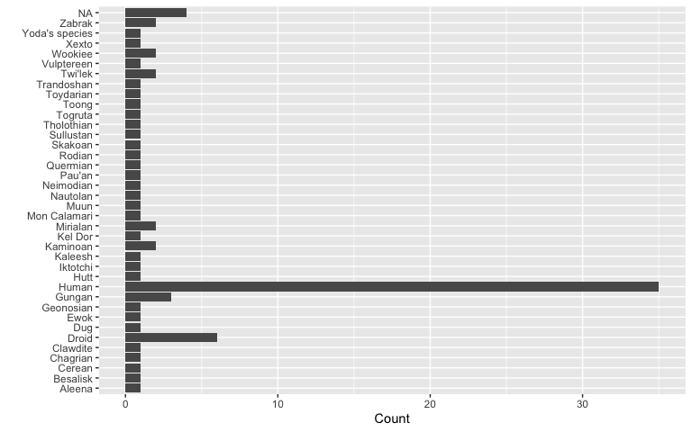
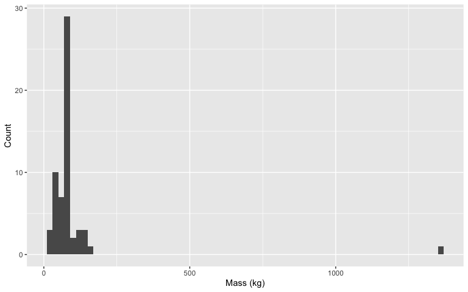
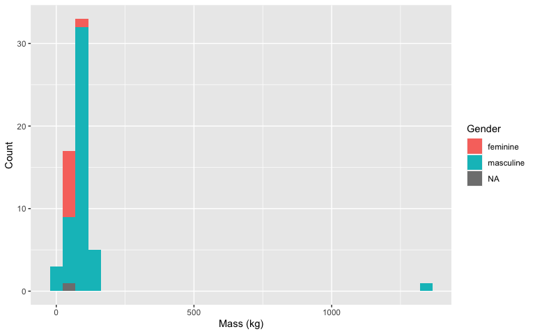
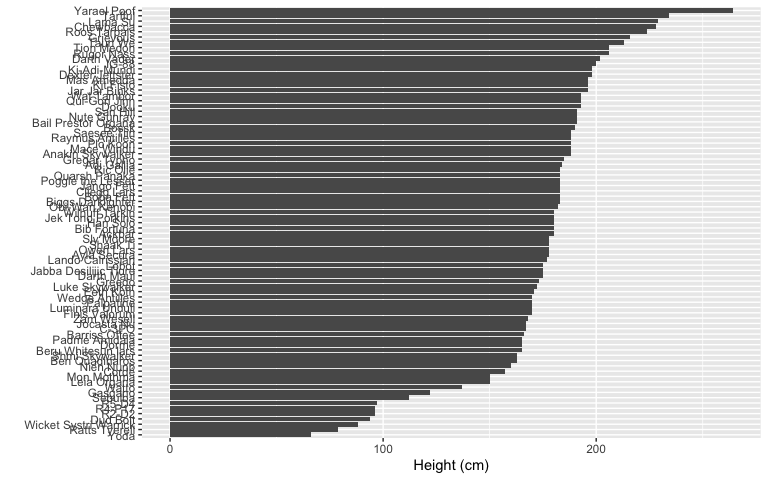
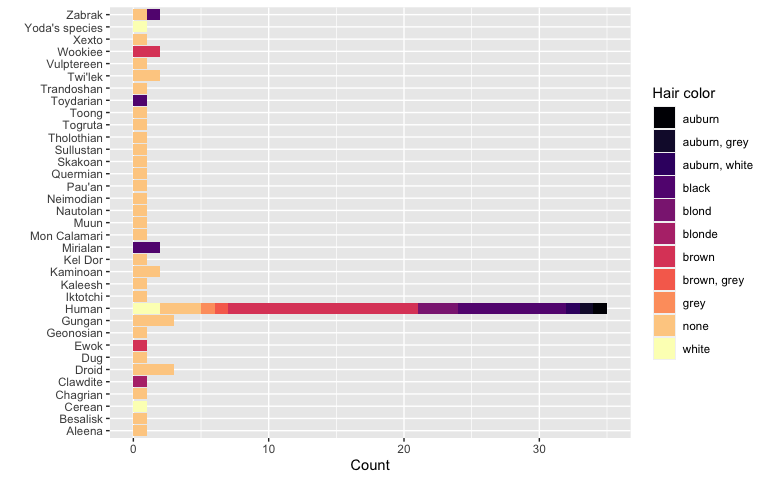
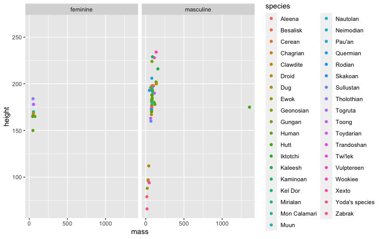

Visualizing Starwars characters
================
2023-01-27

## Basic ggplot practice

1.  Glimpse at the starwars data frame.

<!-- end list -->

``` r
glimpse(starwars)
```

    ## Rows: 87
    ## Columns: 14
    ## $ name       <chr> "Luke Skywalker", "C-3PO", "R2-D2", "Darth Vader", "Leia Or…
    ## $ height     <int> 172, 167, 96, 202, 150, 178, 165, 97, 183, 182, 188, 180, 2…
    ## $ mass       <dbl> 77.0, 75.0, 32.0, 136.0, 49.0, 120.0, 75.0, 32.0, 84.0, 77.…
    ## $ hair_color <chr> "blond", NA, NA, "none", "brown", "brown, grey", "brown", N…
    ## $ skin_color <chr> "fair", "gold", "white, blue", "white", "light", "light", "…
    ## $ eye_color  <chr> "blue", "yellow", "red", "yellow", "brown", "blue", "blue",…
    ## $ birth_year <dbl> 19.0, 112.0, 33.0, 41.9, 19.0, 52.0, 47.0, NA, 24.0, 57.0, …
    ## $ sex        <chr> "male", "none", "none", "male", "female", "male", "female",…
    ## $ gender     <chr> "masculine", "masculine", "masculine", "masculine", "femini…
    ## $ homeworld  <chr> "Tatooine", "Tatooine", "Naboo", "Tatooine", "Alderaan", "T…
    ## $ species    <chr> "Human", "Droid", "Droid", "Human", "Human", "Human", "Huma…
    ## $ films      <list> <"The Empire Strikes Back", "Revenge of the Sith", "Return…
    ## $ vehicles   <list> <"Snowspeeder", "Imperial Speeder Bike">, <>, <>, <>, "Imp…
    ## $ starships  <list> <"X-wing", "Imperial shuttle">, <>, <>, "TIE Advanced x1",…

2.  Modify the following plot to:

<!-- end list -->

  - map color to `gender` and size to `birth_year`,  
  - set the transparency (`alpha`) of all of the points 0.6  
  - replace the `---` to add a title and axis labels with units (assume
    height is in cm and mass is in kg).

<!-- end list -->

``` r
ggplot(starwars, aes(x = height, y = mass, color = gender, size = birth_year)) +
  geom_point() +
  labs(x = "Height (cm)",
       y = "Mass (kg)",
       title = "Character mass vs. height")
```

    ## Warning: Removed 51 rows containing missing values (geom_point).

<!-- -->

3.  Modify the following plot to change the fill color of all of the
    bars to pink. Try first setting color to pink. The result may not be
    what you were expecting. We didn’t explicitly go over how to change
    the fill color but the word `fill` is a hint - see if you can figure
    it out. You can either use the word `"pink"` (in quotes) or Google
    “hex color picker,” select a pink-ish color, and use `#` followed
    by the six-digit hex color that corresponds to your pink color
    (e.g., `"#FFFFFF"`).

Remove the `coord_flip` layer to see what happens. Keep whichever plot
(with or without `coord_flip()`) looks better.

``` r
ggplot(starwars, aes(x = reorder(species, species, function(x) length(x)))) +
  geom_bar(fill = "#ec03fc") +
  labs(x = "Species", y = "Count") +
  coord_flip()
```

<!-- -->

4.  Using the Palmer penguins data, map `body_mass_g` to the x-axis,
    `flipper_length_mm` to the y-axis, color to sex. Then facet by
    island and add a title and axis labels. Remove the `#` at the
    beginning of each line before running this code chunk.

<!-- end list -->

``` r
ggplot(penguins, aes(x = body_mass_g, y = flipper_length_mm, color = sex)) +
  geom_point() +
  facet_wrap(~ island) +
  labs(x = "Body mass (g)",
       y = "Flipper length (mm)",
       title = "Penguin body mass vs. flipper length")
```

    ## Warning: Removed 2 rows containing missing values (geom_point).

<!-- -->

5.  Copy and paste the code from above into the chunk below, then
    replace `facet_wrap` with `facet_grid` to facet by both island and
    species.

<!-- end list -->

``` r
ggplot(penguins, aes(x = body_mass_g, y = flipper_length_mm, color = sex)) +
  geom_point() +
  facet_grid(species ~ island) +
  labs(x = "Body mass (g)",
       y = "Flipper length (mm)",
       title = "Penguin body mass vs. flipper length")
```

    ## Warning: Removed 2 rows containing missing values (geom_point).

<!-- -->

6.  If this was easy for you, play around with any of the code above to
    see what happens when you make additional changes. See the [R4DS
    visualization
    chapter](https://r4ds.had.co.nz/data-visualisation.html) to explore
    different geoms, aesthetic options, etc.

## Visualizing numerical and categorical data practice

7.  Pick a single categorical variable from the `starwars` data set and
    make a bar plot of its distribution.

(A little bit of starter code is provided below, and the code chunk is
set to not be evaluated with `eval = FALSE` because the current code in
there is not valid code and hence the document wouldn’t knit. Once you
replace the code with valid code, set the chunk option to `eval = TRUE`,
or remove the `eval` option altogether since it’s set to `TRUE` by
default.)

``` r
ggplot(starwars, aes(y = species)) +
  geom_bar() +
  labs(x = "Count", y = "")
```

<!-- -->

8.  Pick a single numerical variable and make a histogram of it.

(This time no starter code is provided, you’re on your own\!)

``` r
ggplot(starwars, aes(x = mass)) +
  geom_histogram(binwidth = 20) +
  labs(x = "Mass (kg)", y = "Count")
```

    ## Warning: Removed 28 rows containing non-finite values (stat_bin).

<!-- -->

9.  Pick a numerical variable and a categorical variable and make a
    visualization (you pick the type\!) to visualize the relationship
    between the two variables. Along with your code and output, provide
    an interpretation of the visualization.

<!-- end list -->

``` r
#there are lots of options - here are just a few

ggplot(starwars, aes(x = mass, fill = gender)) +
  geom_histogram() +
  labs(x = "Mass (kg)", y = "Count", fill = "Gender")
```

    ## `stat_bin()` using `bins = 30`. Pick better value with `binwidth`.

    ## Warning: Removed 28 rows containing non-finite values (stat_bin).

<!-- -->

``` r
starwars %>%
  drop_na(height) %>% #remove rows where height is missing
 ggplot(aes(y = reorder(name, height), x = height)) +
  geom_bar(stat = "identity") +
  labs(y = "", x = "Height (cm)")
```

<!-- -->

10. Pick two categorical variables and make a visualization to show the
    relationship between the two variables. Along with your code and
    output, provide an interpretation of the visualization.

<!-- end list -->

``` r
#lots of possibilities - here's just one

starwars %>%
  drop_na(hair_color, species) %>% #remove rows where hair color or species is missing
ggplot(aes(y = species, fill = hair_color)) +
  geom_bar() +
  labs(x = "Count", y = "", fill = "Hair color") +
  scale_fill_viridis_d(option = "magma") #use nicer color palette
```

<!-- -->

11. Pick two numerical variables and two categorical variables and make
    a visualization that incorporates all of them and provide an
    interpretation with your answer.

<!-- end list -->

``` r
starwars %>%
  drop_na(gender) %>% #remove rows where gender is NA
ggplot(aes(x = mass, y = height, color = species)) +
  geom_point() +
  facet_wrap(~ gender)
```

    ## Warning: Removed 25 rows containing missing values (geom_point).

<!-- -->

12. If you finish early, make some more plots in the chunk below using
    the `starwars` or `penguins` datasets. Play around with the
    different aesthetics (color, size, shape, alpha, faceting).
