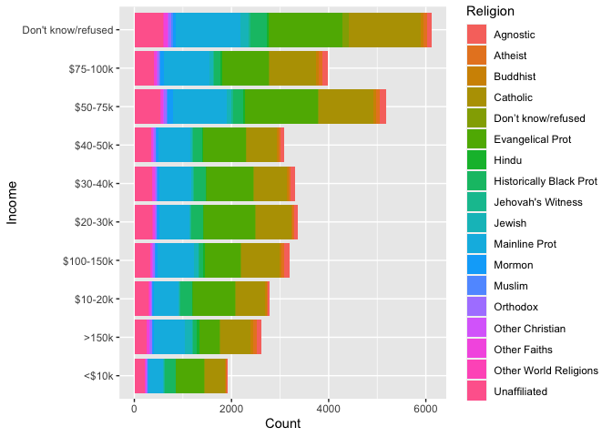
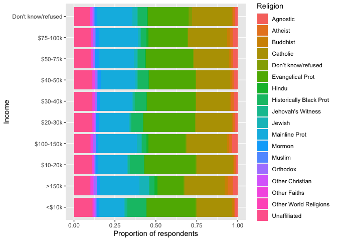

ae-06: `tidyr` and pivoting - solutions
================

``` r
library(tidyverse)
```

    ## ── Attaching packages ─────────────────────────────────────── tidyverse 1.3.2 ──
    ## ✔ ggplot2 3.3.6     ✔ purrr   1.0.1
    ## ✔ tibble  3.1.8     ✔ dplyr   1.0.7
    ## ✔ tidyr   1.1.4     ✔ stringr 1.5.0
    ## ✔ readr   2.1.1     ✔ forcats 0.5.1
    ## ── Conflicts ────────────────────────────────────────── tidyverse_conflicts() ──
    ## ✖ dplyr::filter() masks stats::filter()
    ## ✖ dplyr::lag()    masks stats::lag()

1.  The following is survey data containing information about respondent
    religion and the number of respondents earning the listed income
    ranges. Is the data “tidy”? How would it need to be formatted if we
    wanted to create a bar plot that maps number of respondents to the x
    axis, income to the y axis, and religion to fill color?

<!-- end list -->

``` r
relig_income
```

    ## # A tibble: 18 × 11
    ##    religion      `<$10k` $10-2…¹ $20-3…² $30-4…³ $40-5…⁴ $50-7…⁵ $75-1…⁶ $100-…⁷
    ##    <chr>           <dbl>   <dbl>   <dbl>   <dbl>   <dbl>   <dbl>   <dbl>   <dbl>
    ##  1 Agnostic           27      34      60      81      76     137     122     109
    ##  2 Atheist            12      27      37      52      35      70      73      59
    ##  3 Buddhist           27      21      30      34      33      58      62      39
    ##  4 Catholic          418     617     732     670     638    1116     949     792
    ##  5 Don’t know/r…      15      14      15      11      10      35      21      17
    ##  6 Evangelical …     575     869    1064     982     881    1486     949     723
    ##  7 Hindu               1       9       7       9      11      34      47      48
    ##  8 Historically…     228     244     236     238     197     223     131      81
    ##  9 Jehovah's Wi…      20      27      24      24      21      30      15      11
    ## 10 Jewish             19      19      25      25      30      95      69      87
    ## 11 Mainline Prot     289     495     619     655     651    1107     939     753
    ## 12 Mormon             29      40      48      51      56     112      85      49
    ## 13 Muslim              6       7       9      10       9      23      16       8
    ## 14 Orthodox           13      17      23      32      32      47      38      42
    ## 15 Other Christ…       9       7      11      13      13      14      18      14
    ## 16 Other Faiths       20      33      40      46      49      63      46      40
    ## 17 Other World …       5       2       3       4       2       7       3       4
    ## 18 Unaffiliated      217     299     374     365     341     528     407     321
    ## # … with 2 more variables: `>150k` <dbl>, `Don't know/refused` <dbl>, and
    ## #   abbreviated variable names ¹​`$10-20k`, ²​`$20-30k`, ³​`$30-40k`, ⁴​`$40-50k`,
    ## #   ⁵​`$50-75k`, ⁶​`$75-100k`, ⁷​`$100-150k`

2.  Use the `pivot_longer` function to convert the dataset from wide to
    long format so that it contains a column for `income` and a column
    for `count`. Assign the output to a new object called
    `relig_income_long`.

<!-- end list -->

``` r
relig_income_long <- relig_income %>%
  pivot_longer(cols = 2:11,
               names_to = "income", 
               values_to = "count")

relig_income_long
```

    ## # A tibble: 180 × 3
    ##    religion income             count
    ##    <chr>    <chr>              <dbl>
    ##  1 Agnostic <$10k                 27
    ##  2 Agnostic $10-20k               34
    ##  3 Agnostic $20-30k               60
    ##  4 Agnostic $30-40k               81
    ##  5 Agnostic $40-50k               76
    ##  6 Agnostic $50-75k              137
    ##  7 Agnostic $75-100k             122
    ##  8 Agnostic $100-150k            109
    ##  9 Agnostic >150k                 84
    ## 10 Agnostic Don't know/refused    96
    ## # … with 170 more rows

3.  Create a bar plot with `relig_income_long` that maps number of
    respondents to the x axis, income to the y axis, and religion to
    fill color.

<!-- end list -->

``` r
ggplot(relig_income_long, aes(x = count, y = income, fill = religion)) +
  geom_bar(stat = "identity") +
  labs(x = "Count", y = "Income", fill = "Religion")
```

<!-- -->

4.  Since the number of respondents was different across religions and
    incomes, it’s hard to determine if income is different depending on
    religious affiliation. Modify the bar plot so that we can more
    effectively make this comparison.

<!-- end list -->

``` r
ggplot(relig_income_long, aes(x = count, y = income, fill = religion)) +
  geom_bar(stat = "identity",
           position = "fill") +
  labs(x = "Proportion of respondents", y = "Income", fill = "Religion")
```

<!-- -->

5.  Use the `pivot_wider` function to convert `relig_income_long` back
    to the original wide format.

<!-- end list -->

``` r
relig_income_long %>%
  pivot_wider(names_from = income, values_from = count)
```

    ## # A tibble: 18 × 11
    ##    religion      `<$10k` $10-2…¹ $20-3…² $30-4…³ $40-5…⁴ $50-7…⁵ $75-1…⁶ $100-…⁷
    ##    <chr>           <dbl>   <dbl>   <dbl>   <dbl>   <dbl>   <dbl>   <dbl>   <dbl>
    ##  1 Agnostic           27      34      60      81      76     137     122     109
    ##  2 Atheist            12      27      37      52      35      70      73      59
    ##  3 Buddhist           27      21      30      34      33      58      62      39
    ##  4 Catholic          418     617     732     670     638    1116     949     792
    ##  5 Don’t know/r…      15      14      15      11      10      35      21      17
    ##  6 Evangelical …     575     869    1064     982     881    1486     949     723
    ##  7 Hindu               1       9       7       9      11      34      47      48
    ##  8 Historically…     228     244     236     238     197     223     131      81
    ##  9 Jehovah's Wi…      20      27      24      24      21      30      15      11
    ## 10 Jewish             19      19      25      25      30      95      69      87
    ## 11 Mainline Prot     289     495     619     655     651    1107     939     753
    ## 12 Mormon             29      40      48      51      56     112      85      49
    ## 13 Muslim              6       7       9      10       9      23      16       8
    ## 14 Orthodox           13      17      23      32      32      47      38      42
    ## 15 Other Christ…       9       7      11      13      13      14      18      14
    ## 16 Other Faiths       20      33      40      46      49      63      46      40
    ## 17 Other World …       5       2       3       4       2       7       3       4
    ## 18 Unaffiliated      217     299     374     365     341     528     407     321
    ## # … with 2 more variables: `>150k` <dbl>, `Don't know/refused` <dbl>, and
    ## #   abbreviated variable names ¹​`$10-20k`, ²​`$20-30k`, ³​`$30-40k`, ⁴​`$40-50k`,
    ## #   ⁵​`$50-75k`, ⁶​`$75-100k`, ⁷​`$100-150k`

6.  The following dataset contains information on individually tagged
    fish (`fish`), the `station` at which each fish was measured, and
    whether or not it was seen (1 for yes - only observations where fish
    were seen are included). Note the number of rows and columns in the
    dataset.

<!-- end list -->

``` r
fish_encounters
```

    ## # A tibble: 114 × 3
    ##    fish  station  seen
    ##    <fct> <fct>   <int>
    ##  1 4842  Release     1
    ##  2 4842  I80_1       1
    ##  3 4842  Lisbon      1
    ##  4 4842  Rstr        1
    ##  5 4842  Base_TD     1
    ##  6 4842  BCE         1
    ##  7 4842  BCW         1
    ##  8 4842  BCE2        1
    ##  9 4842  BCW2        1
    ## 10 4842  MAE         1
    ## # … with 104 more rows

To be able to create a statistical model with this data, we also need to
explicitly include observations where researchers went out to look for
fish but none were seen, which we would indicate with a 0 in the data.
Use the `pivot_wider` function to convert the dataset to wide format,
where `names_from = station` and `values_from = seen`. Explain in your
own words how the dataset was transformed. What to the NAs represent?
Add the additional argument `values_fill = 0`. What happened to the NAs?

``` r
fish_long <- fish_encounters %>%
     pivot_wider(names_from = station, values_from = seen)

fish_long
```

    ## # A tibble: 19 × 12
    ##    fish  Release I80_1 Lisbon  Rstr Base_TD   BCE   BCW  BCE2  BCW2   MAE   MAW
    ##    <fct>   <int> <int>  <int> <int>   <int> <int> <int> <int> <int> <int> <int>
    ##  1 4842        1     1      1     1       1     1     1     1     1     1     1
    ##  2 4843        1     1      1     1       1     1     1     1     1     1     1
    ##  3 4844        1     1      1     1       1     1     1     1     1     1     1
    ##  4 4845        1     1      1     1       1    NA    NA    NA    NA    NA    NA
    ##  5 4847        1     1      1    NA      NA    NA    NA    NA    NA    NA    NA
    ##  6 4848        1     1      1     1      NA    NA    NA    NA    NA    NA    NA
    ##  7 4849        1     1     NA    NA      NA    NA    NA    NA    NA    NA    NA
    ##  8 4850        1     1     NA     1       1     1     1    NA    NA    NA    NA
    ##  9 4851        1     1     NA    NA      NA    NA    NA    NA    NA    NA    NA
    ## 10 4854        1     1     NA    NA      NA    NA    NA    NA    NA    NA    NA
    ## 11 4855        1     1      1     1       1    NA    NA    NA    NA    NA    NA
    ## 12 4857        1     1      1     1       1     1     1     1     1    NA    NA
    ## 13 4858        1     1      1     1       1     1     1     1     1     1     1
    ## 14 4859        1     1      1     1       1    NA    NA    NA    NA    NA    NA
    ## 15 4861        1     1      1     1       1     1     1     1     1     1     1
    ## 16 4862        1     1      1     1       1     1     1     1     1    NA    NA
    ## 17 4863        1     1     NA    NA      NA    NA    NA    NA    NA    NA    NA
    ## 18 4864        1     1     NA    NA      NA    NA    NA    NA    NA    NA    NA
    ## 19 4865        1     1      1    NA      NA    NA    NA    NA    NA    NA    NA

``` r
fish_long0 <- fish_encounters %>%
     pivot_wider(names_from = station, values_from = seen, values_fill = 0)

fish_long0
```

    ## # A tibble: 19 × 12
    ##    fish  Release I80_1 Lisbon  Rstr Base_TD   BCE   BCW  BCE2  BCW2   MAE   MAW
    ##    <fct>   <int> <int>  <int> <int>   <int> <int> <int> <int> <int> <int> <int>
    ##  1 4842        1     1      1     1       1     1     1     1     1     1     1
    ##  2 4843        1     1      1     1       1     1     1     1     1     1     1
    ##  3 4844        1     1      1     1       1     1     1     1     1     1     1
    ##  4 4845        1     1      1     1       1     0     0     0     0     0     0
    ##  5 4847        1     1      1     0       0     0     0     0     0     0     0
    ##  6 4848        1     1      1     1       0     0     0     0     0     0     0
    ##  7 4849        1     1      0     0       0     0     0     0     0     0     0
    ##  8 4850        1     1      0     1       1     1     1     0     0     0     0
    ##  9 4851        1     1      0     0       0     0     0     0     0     0     0
    ## 10 4854        1     1      0     0       0     0     0     0     0     0     0
    ## 11 4855        1     1      1     1       1     0     0     0     0     0     0
    ## 12 4857        1     1      1     1       1     1     1     1     1     0     0
    ## 13 4858        1     1      1     1       1     1     1     1     1     1     1
    ## 14 4859        1     1      1     1       1     0     0     0     0     0     0
    ## 15 4861        1     1      1     1       1     1     1     1     1     1     1
    ## 16 4862        1     1      1     1       1     1     1     1     1     0     0
    ## 17 4863        1     1      0     0       0     0     0     0     0     0     0
    ## 18 4864        1     1      0     0       0     0     0     0     0     0     0
    ## 19 4865        1     1      1     0       0     0     0     0     0     0     0

7.  Convert `fish_long0` back to long format so that it is tidy for
    formulating our model but now contains 0s for observations when a
    fish was not observed. How many rows does it contain now? Why does
    it contain more rows than the original dataset?

<!-- end list -->

``` r
fish_long0 %>%
  pivot_longer(cols = 2:12,
               names_to = "station", 
               values_to = "seen")
```

    ## # A tibble: 209 × 3
    ##    fish  station  seen
    ##    <fct> <chr>   <int>
    ##  1 4842  Release     1
    ##  2 4842  I80_1       1
    ##  3 4842  Lisbon      1
    ##  4 4842  Rstr        1
    ##  5 4842  Base_TD     1
    ##  6 4842  BCE         1
    ##  7 4842  BCW         1
    ##  8 4842  BCE2        1
    ##  9 4842  BCW2        1
    ## 10 4842  MAE         1
    ## # … with 199 more rows
