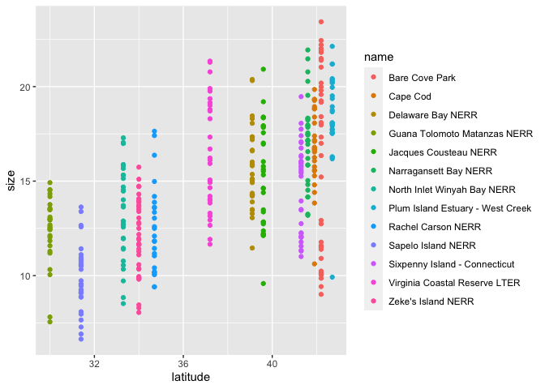
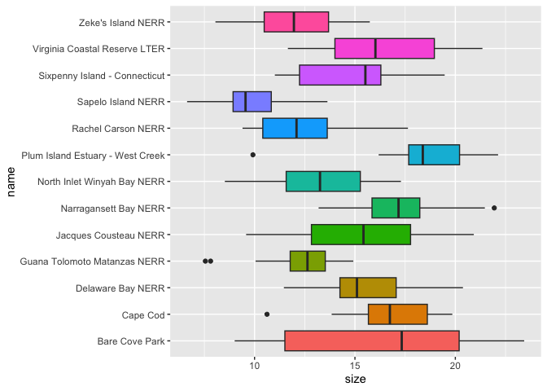
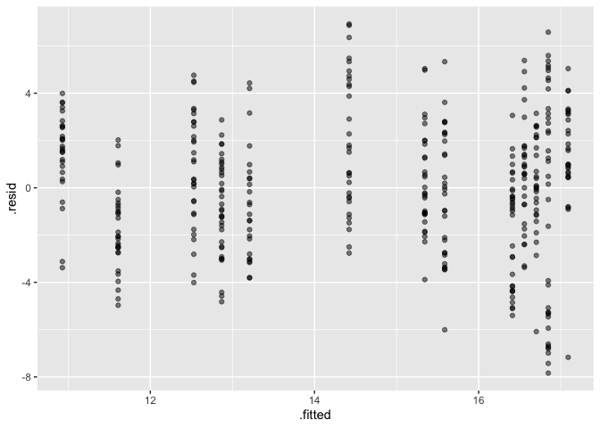
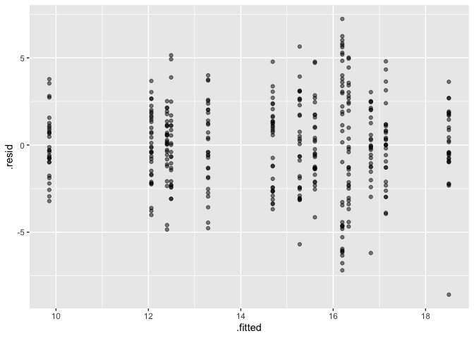

Modeling fiddler crab size across latitudes
================

## Peek at the data

``` r
glimpse(pie_crab)
```

    ## Rows: 392
    ## Columns: 9
    ## $ date          <date> 2016-07-24, 2016-07-24, 2016-07-24, 2016-07-24, 2016-07…
    ## $ latitude      <dbl> 30, 30, 30, 30, 30, 30, 30, 30, 30, 30, 30, 30, 30, 30, …
    ## $ site          <chr> "GTM", "GTM", "GTM", "GTM", "GTM", "GTM", "GTM", "GTM", …
    ## $ size          <dbl> 12.43, 14.18, 14.52, 12.94, 12.45, 12.99, 10.32, 11.19, …
    ## $ air_temp      <dbl> 21.792, 21.792, 21.792, 21.792, 21.792, 21.792, 21.792, …
    ## $ air_temp_sd   <dbl> 6.391, 6.391, 6.391, 6.391, 6.391, 6.391, 6.391, 6.391, …
    ## $ water_temp    <dbl> 24.502, 24.502, 24.502, 24.502, 24.502, 24.502, 24.502, …
    ## $ water_temp_sd <dbl> 6.121, 6.121, 6.121, 6.121, 6.121, 6.121, 6.121, 6.121, …
    ## $ name          <chr> "Guana Tolomoto Matanzas NERR", "Guana Tolomoto Matanzas…

## Visually explore the data

Create a scatter plot that maps latitude to the x-axis and size to the
y-axis. What relationship could we test for using a statistical model?

``` r
ggplot(pie_crab, aes(x = latitude, y = size, color = name)) +
  geom_point()
```

<!-- -->

Create a boxplot that maps name to the y-axis and size to the x-axis.
What difference could we test for using a statistical model?

``` r
ggplot(pie_crab, aes(y = name, x = size, fill = name)) +
  geom_boxplot() +
  theme(legend.position = "none")
```

<!-- -->

## Crab size vs. latitude

Fitting the model step by step:

``` r
linear_reg() %>%                                # specify: what model will we fit?
  set_engine("lm") %>%                          # set engine : how will we fit the model?
  fit(size ~ latitude, data = pie_crab)        # fit: actually fit model based on formula
```

    ## parsnip model object
    ## 
    ## Fit time:  4ms 
    ## 
    ## Call:
    ## stats::lm(formula = size ~ latitude, data = data)
    ## 
    ## Coefficients:
    ## (Intercept)     latitude  
    ##     -3.6244       0.4851

Save the model output to an obmect called `crab_lat_fit`.

``` r
crab_lat_fit <- linear_reg() %>%
  set_engine("lm") %>%
  fit(size ~ latitude, data = pie_crab)
```

Now we can examine our model output.

``` r
#look at model output
crab_lat_fit
```

    ## parsnip model object
    ## 
    ## Fit time:  2ms 
    ## 
    ## Call:
    ## stats::lm(formula = size ~ latitude, data = data)
    ## 
    ## Coefficients:
    ## (Intercept)     latitude  
    ##     -3.6244       0.4851

``` r
#get the object names for crab_lat_fit output
names(crab_lat_fit)
```

    ## [1] "lvl"     "spec"    "fit"     "preproc" "elapsed"

``` r
#look at some of the model output objects 
crab_lat_fit$fit
```

    ## 
    ## Call:
    ## stats::lm(formula = size ~ latitude, data = data)
    ## 
    ## Coefficients:
    ## (Intercept)     latitude  
    ##     -3.6244       0.4851

``` r
crab_lat_fit$elapsed
```

    ##    user  system elapsed 
    ##   0.002   0.000   0.002

Here, we tidy the model parameter output into a tidy dataframe. What
does the estimate value of the intercept represent? What does the
latitude estimate represent? What does the p-value represent?

``` r
tidy(crab_lat_fit)
```

    ## # A tibble: 2 × 5
    ##   term        estimate std.error statistic  p.value
    ##   <chr>          <dbl>     <dbl>     <dbl>    <dbl>
    ## 1 (Intercept)   -3.62     1.27       -2.84 4.68e- 3
    ## 2 latitude       0.485    0.0336     14.4  3.60e-38

We can also create tidy output for overall model statistics. What does
the R-squared represent? What does the p-value represent?

``` r
glance(crab_lat_fit)
```

    ## # A tibble: 1 × 12
    ##   r.squared adj.r.squa…¹ sigma stati…²  p.value    df logLik   AIC   BIC devia…³
    ##       <dbl>        <dbl> <dbl>   <dbl>    <dbl> <dbl>  <dbl> <dbl> <dbl>   <dbl>
    ## 1     0.348        0.347  2.83    209. 3.60e-38     1  -963. 1932. 1944.   3127.
    ## # … with 2 more variables: df.residual <int>, nobs <int>, and abbreviated
    ## #   variable names ¹​adj.r.squared, ²​statistic, ³​deviance

Here, we create a table containing observed values (`size`, `latitude`),
fitted values (`.fitted`) (i.e., expected or model-fitted size for each
latitude), residuals (`.resid`) (i.e., difference between
expected/fitted size and observed size for each latitude), and several
other statistics that we won’t talk about right now.

``` r
augment(crab_lat_fit$fit)
```

    ## # A tibble: 392 × 8
    ##     size latitude .fitted .resid   .hat .sigma   .cooksd .std.resid
    ##    <dbl>    <dbl>   <dbl>  <dbl>  <dbl>  <dbl>     <dbl>      <dbl>
    ##  1  12.4       30    10.9  1.50  0.0109   2.83 0.00156       0.533 
    ##  2  14.2       30    10.9  3.25  0.0109   2.83 0.00732       1.15  
    ##  3  14.5       30    10.9  3.59  0.0109   2.83 0.00893       1.28  
    ##  4  12.9       30    10.9  2.01  0.0109   2.83 0.00280       0.714 
    ##  5  12.4       30    10.9  1.52  0.0109   2.83 0.00160       0.540 
    ##  6  13.0       30    10.9  2.06  0.0109   2.83 0.00294       0.732 
    ##  7  10.3       30    10.9 -0.609 0.0109   2.83 0.000257     -0.216 
    ##  8  11.2       30    10.9  0.261 0.0109   2.84 0.0000471     0.0926
    ##  9  12.7       30    10.9  1.75  0.0109   2.83 0.00212       0.622 
    ## 10  14.6       30    10.9  3.62  0.0109   2.83 0.00908       1.29  
    ## # … with 382 more rows

And we can use the augment table to check our residuals by plotting the
fitted values (expected values of size) vs the residuals (the difference
between the fitted size values and the actual size observations). The
points on the plot should look random - if there is any type of pattern,
then there might be another variable that is not included in the model
but has an effect on crab size.

``` r
crab_aug <- augment(crab_lat_fit$fit)

ggplot(crab_aug, aes(x = .fitted, y = .resid)) +
  geom_point(alpha = 0.5)
```

<!-- -->

## Crab size vs. name (sample location)

Fitting the model step by step:

``` r
linear_reg() %>%                                # specify: what model will we fit?
  set_engine("lm") %>%                          # set engine : how will we fit the model?
  fit(size ~ name, data = pie_crab)             # fit: actually fit model based on formula
```

    ## parsnip model object
    ## 
    ## Fit time:  2ms 
    ## 
    ## Call:
    ## stats::lm(formula = size ~ name, data = data)
    ## 
    ## Coefficients:
    ##                          (Intercept)                          nameCape Cod  
    ##                              16.1973                                0.6179  
    ##                nameDelaware Bay NERR      nameGuana Tolomoto Matanzas NERR  
    ##                              -0.5933                               -3.7941  
    ##            nameJacques Cousteau NERR             nameNarragansett Bay NERR  
    ##                              -0.9226                                0.9430  
    ##      nameNorth Inlet Winyah Bay NERR  namePlum Island Estuary - West Creek  
    ##                              -2.9053                                2.3066  
    ##               nameRachel Carson NERR                nameSapelo Island NERR  
    ##                              -3.7057                               -6.3430  
    ##    nameSixpenny Island - Connecticut     nameVirginia Coastal Reserve LTER  
    ##                              -1.5058                                0.1384  
    ##               nameZeke's Island NERR  
    ##                              -4.1336

Save the model output to an obmect called `crab_site_fit`.

``` r
crab_site_fit <- linear_reg() %>%
  set_engine("lm") %>%
  fit(size ~ name, data = pie_crab)
```

Examine our model output.

``` r
#look at model output
crab_site_fit
```

    ## parsnip model object
    ## 
    ## Fit time:  4ms 
    ## 
    ## Call:
    ## stats::lm(formula = size ~ name, data = data)
    ## 
    ## Coefficients:
    ##                          (Intercept)                          nameCape Cod  
    ##                              16.1973                                0.6179  
    ##                nameDelaware Bay NERR      nameGuana Tolomoto Matanzas NERR  
    ##                              -0.5933                               -3.7941  
    ##            nameJacques Cousteau NERR             nameNarragansett Bay NERR  
    ##                              -0.9226                                0.9430  
    ##      nameNorth Inlet Winyah Bay NERR  namePlum Island Estuary - West Creek  
    ##                              -2.9053                                2.3066  
    ##               nameRachel Carson NERR                nameSapelo Island NERR  
    ##                              -3.7057                               -6.3430  
    ##    nameSixpenny Island - Connecticut     nameVirginia Coastal Reserve LTER  
    ##                              -1.5058                                0.1384  
    ##               nameZeke's Island NERR  
    ##                              -4.1336

``` r
#get the object names for crab_lat_fit output
names(crab_site_fit)
```

    ## [1] "lvl"     "spec"    "fit"     "preproc" "elapsed"

``` r
#look at some of the model output objects 
crab_site_fit$fit
```

    ## 
    ## Call:
    ## stats::lm(formula = size ~ name, data = data)
    ## 
    ## Coefficients:
    ##                          (Intercept)                          nameCape Cod  
    ##                              16.1973                                0.6179  
    ##                nameDelaware Bay NERR      nameGuana Tolomoto Matanzas NERR  
    ##                              -0.5933                               -3.7941  
    ##            nameJacques Cousteau NERR             nameNarragansett Bay NERR  
    ##                              -0.9226                                0.9430  
    ##      nameNorth Inlet Winyah Bay NERR  namePlum Island Estuary - West Creek  
    ##                              -2.9053                                2.3066  
    ##               nameRachel Carson NERR                nameSapelo Island NERR  
    ##                              -3.7057                               -6.3430  
    ##    nameSixpenny Island - Connecticut     nameVirginia Coastal Reserve LTER  
    ##                              -1.5058                                0.1384  
    ##               nameZeke's Island NERR  
    ##                              -4.1336

``` r
crab_site_fit$elapsed
```

    ##    user  system elapsed 
    ##   0.003   0.000   0.003

Here, we tidy the model output into a tidy dataframe. What does the
value of the intercept represent? What do the remaining values
represent?

``` r
tidy(crab_site_fit)
```

    ## # A tibble: 13 × 5
    ##    term                                 estimate std.error statistic   p.value
    ##    <chr>                                   <dbl>     <dbl>     <dbl>     <dbl>
    ##  1 (Intercept)                            16.2       0.433    37.4   2.36e-129
    ##  2 nameCape Cod                            0.618     0.666     0.927 3.54e-  1
    ##  3 nameDelaware Bay NERR                  -0.593     0.647    -0.917 3.60e-  1
    ##  4 nameGuana Tolomoto Matanzas NERR       -3.79      0.659    -5.75  1.80e-  8
    ##  5 nameJacques Cousteau NERR              -0.923     0.647    -1.43  1.55e-  1
    ##  6 nameNarragansett Bay NERR               0.943     0.653     1.44  1.49e-  1
    ##  7 nameNorth Inlet Winyah Bay NERR        -2.91      0.647    -4.49  9.38e-  6
    ##  8 namePlum Island Estuary - West Creek    2.31      0.659     3.50  5.24e-  4
    ##  9 nameRachel Carson NERR                 -3.71      0.682    -5.44  9.71e-  8
    ## 10 nameSapelo Island NERR                 -6.34      0.647    -9.81  2.20e- 20
    ## 11 nameSixpenny Island - Connecticut      -1.51      0.630    -2.39  1.74e-  2
    ## 12 nameVirginia Coastal Reserve LTER       0.138     0.647     0.214 8.31e-  1
    ## 13 nameZeke's Island NERR                 -4.13      0.621    -6.66  9.69e- 11

We can also create tidy output for model statistics.

``` r
glance(crab_lat_fit)
```

    ## # A tibble: 1 × 12
    ##   r.squared adj.r.squa…¹ sigma stati…²  p.value    df logLik   AIC   BIC devia…³
    ##       <dbl>        <dbl> <dbl>   <dbl>    <dbl> <dbl>  <dbl> <dbl> <dbl>   <dbl>
    ## 1     0.348        0.347  2.83    209. 3.60e-38     1  -963. 1932. 1944.   3127.
    ## # … with 2 more variables: df.residual <int>, nobs <int>, and abbreviated
    ## #   variable names ¹​adj.r.squared, ²​statistic, ³​deviance

Here, we create a table containing observed values (`size`, `latitude`),
fitted values (`.fitted`) (i.e., expected/fitted size for each site),
residuals (`.resid`) (i.e., difference between expected/fitted size and
observed size for each latitude).

``` r
augment(crab_site_fit$fit)
```

    ## # A tibble: 392 × 8
    ##     size name                      .fitted  .resid   .hat .sigma .cooksd .std.…¹
    ##    <dbl> <chr>                       <dbl>   <dbl>  <dbl>  <dbl>   <dbl>   <dbl>
    ##  1  12.4 Guana Tolomoto Matanzas …    12.4  0.0268 0.0357   2.64 3.06e-7  0.0104
    ##  2  14.2 Guana Tolomoto Matanzas …    12.4  1.78   0.0357   2.63 1.35e-3  0.687 
    ##  3  14.5 Guana Tolomoto Matanzas …    12.4  2.12   0.0357   2.63 1.91e-3  0.819 
    ##  4  12.9 Guana Tolomoto Matanzas …    12.4  0.537  0.0357   2.64 1.23e-4  0.208 
    ##  5  12.4 Guana Tolomoto Matanzas …    12.4  0.0468 0.0357   2.64 9.33e-7  0.0181
    ##  6  13.0 Guana Tolomoto Matanzas …    12.4  0.587  0.0357   2.64 1.47e-4  0.227 
    ##  7  10.3 Guana Tolomoto Matanzas …    12.4 -2.08   0.0357   2.63 1.85e-3 -0.806 
    ##  8  11.2 Guana Tolomoto Matanzas …    12.4 -1.21   0.0357   2.64 6.28e-4 -0.469 
    ##  9  12.7 Guana Tolomoto Matanzas …    12.4  0.277  0.0357   2.64 3.27e-5  0.107 
    ## 10  14.6 Guana Tolomoto Matanzas …    12.4  2.15   0.0357   2.63 1.96e-3  0.830 
    ## # … with 382 more rows, and abbreviated variable name ¹​.std.resid

And we can use it to check our residuals by plotting the fitted values
(expected values of size) vs the residuals (the difference between the
fitted size values and the actual size observations). Does our model
seem to be a good fit?

``` r
crab_site_aug <- augment(crab_site_fit$fit)

ggplot(crab_site_aug, aes(x = .fitted, y = .resid)) +
  geom_point(alpha = 0.5)
```

<!-- -->
